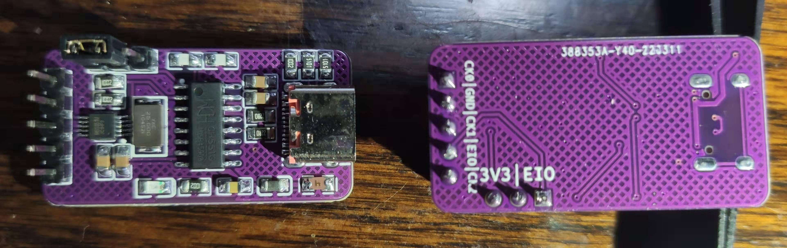

# USB_Clock_Generator
A $1 Clock Generator with USB Type-C, based on CH551 and MS5351 (Compatible with Si5351)

The CH551 would simulate a CH340 Device.  
Send command to CH551 to control the 5351 clock generator.  
To simplify the calculation, at most 2 clocks could be generated in the same time.  
The reduce the phase noise, the fraction function of DIVn is disabled.  
The output freqency ranges from 2.5kHz to 200MHz.  
Refer to the ser.py to check the command format.  
